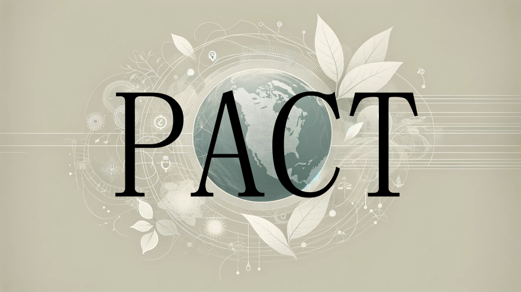

Accurate Energy and Carbon Footprint Tracking.

- [About PACT ](#about-codecarbon-)
- [Quickstart ](#quickstart-)
    - [Installation ](#installation-)
    - [Estimate Carbon Emission ](#start-to-estimate-your-impact-)
- [Workloads ](#workloads-)
    - [Stress Tests ](#stress-tests-)
    - [Computer Vision Benchmarks ](#cv-bm-)
    - [Natural Language Processing Benchmarks ](#nlp-bm-)
    - [Reinforcement Learning Benchmarks ](#rl-bm-)

# About PACT

PACT offers a methodology for accurately analyzing power consumption and tracking carbon emissions of a specific hardware setup. By utilizing PACT, we can make informed decisions aimed at optimizing energy efficiency, minimizing carbon footprints, and advancing toward a greener future.

# Quickstart

## Installation

## Estimate Carbon Emission

# Workloads

## Stress Tests
## Computer Vision Benchmarks
## Natural Language Processing Benchmarks
## Reinforcement Learning Benchmarks
